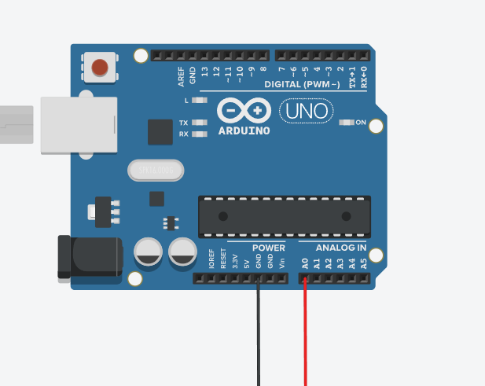

# Simple voltmeter circuit

## How to use
- Turn on Serial monitor, and set the baud rate to the Serial baud rate set in your code (Default: 9600)
- Put a jumper wire in GND, and one in A0.
- Connect the wires to the points which voltage you want to measure

Troubleshooting

This circuit can only measure ranges from 0v - 5v.

This means that it cannot measure negative voltages, so if only 0v is measured when a voltage is expected, put your wires the other way.

## Important note

This cannot be used to measure voltage across components if you are using the same Arduino to power your circuit, unless the ground of your circuit is the same as the ground that you want to measure.

